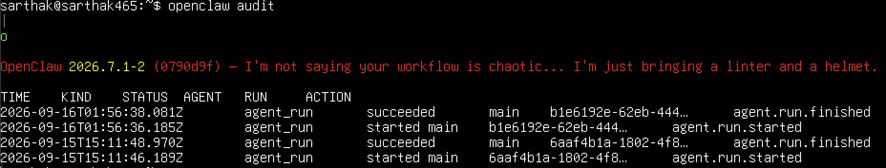
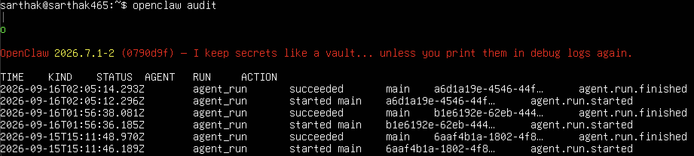
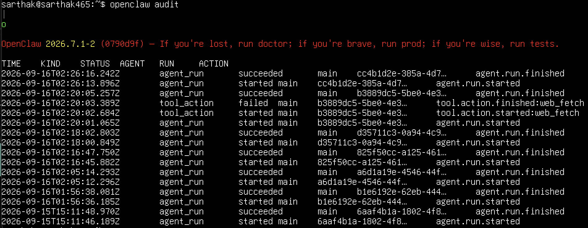

# Task 1.5 #

**Task 1:** openclaw agent --agent main -m "Give me some info about Ubuntu in two sentences"
**Output:** Ubuntu is a versatile and popular Linux distribution known for its ease of use, making it accessible for both personal and professional applications. It is developed by Canonical Ltd., emphasizing regular updates, strong security features, and a wide array of available software packages.



**Task 2:** openclaw agent --agent main -m "Give me a linux command to rename a folder from 'mac_share' to 'csce465-agentsec'"
**Output:** You can rename the folder from `mac_share` to `csce465-agentsec` using the 'mv' command in Linux. Here's the command:
```bash
mv mac_share csce465-agentsec
```
Ensure you are in the directory where `mac_share` is located before running this command, or provide the full path to the folder.



**Task 3:** openclaw agent --agent main -m "Tell me about the new characters introduced in the latest marvel rivals season from this article: $(curl -sL https://www.marvelrivals.com/20260909/41525_1313441.html)"
**Output:** The latest Marvel Rivals season introduces Gorr the God Butcher, who brings his unholy crusade to the game. Additionally, updates include new story content featuring "Butcher's Blasphemy" and "All Gods Will Die," as well as a rework of Scarlet Witch's abilities to enhance her hex-casting capabilities.

